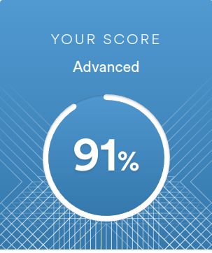

# Yauheni Mileika  

## Junior/Trainee Frontend Developer  
#
___

## __Contact information__

### __Phone:__ +375 33 6020715
### __E-mail:__ vip.carich@gmail.com
### __Telegram:__ @jenshenj
### [Github](https://github.com/jenshenJ)

___
## __Briefly About Myself:__
### Winner of the third stage of the Republican Olympiad in Mathematics.Entered the Belarusian State University of Informatics and Radioelectronics in 2021, majoring in computer science and programming technology. Participant of the international student Olympiad in programming ICPC. Finalist of the international Student Programming Olympiad BSUIR OPEN X RELOAD.

### Studying at the university interested me in studying web programming, or rather frontend development.
### I am sure that the experience I gained in acquiring knowledge at university and school will help me on the way to becoming a professional frontend developer.

---
## __Skills and Proficiency:__
* ### HTML5, CSS3
* ### JavaScript
* ### Data structures and algorithms
* ### DOM API and Events
* ### Preprocessors. SASS
* ### CSS positioning and Flexbox
* ### Git, GitHub
* ### Chrome DevTools
* ### webpack
* ### Linux
* ### Adobe Photoshop, Figma

___
## __Courses:__
  * ### MDN web docs
  * ### RS Schools Course «JavaScript/Front-end» 
___
## __Languages:__
*  ### English - Advanced (according to the online test at www.efset.org)
    
* ### Russian - Native
* ### Belarusian - Native

